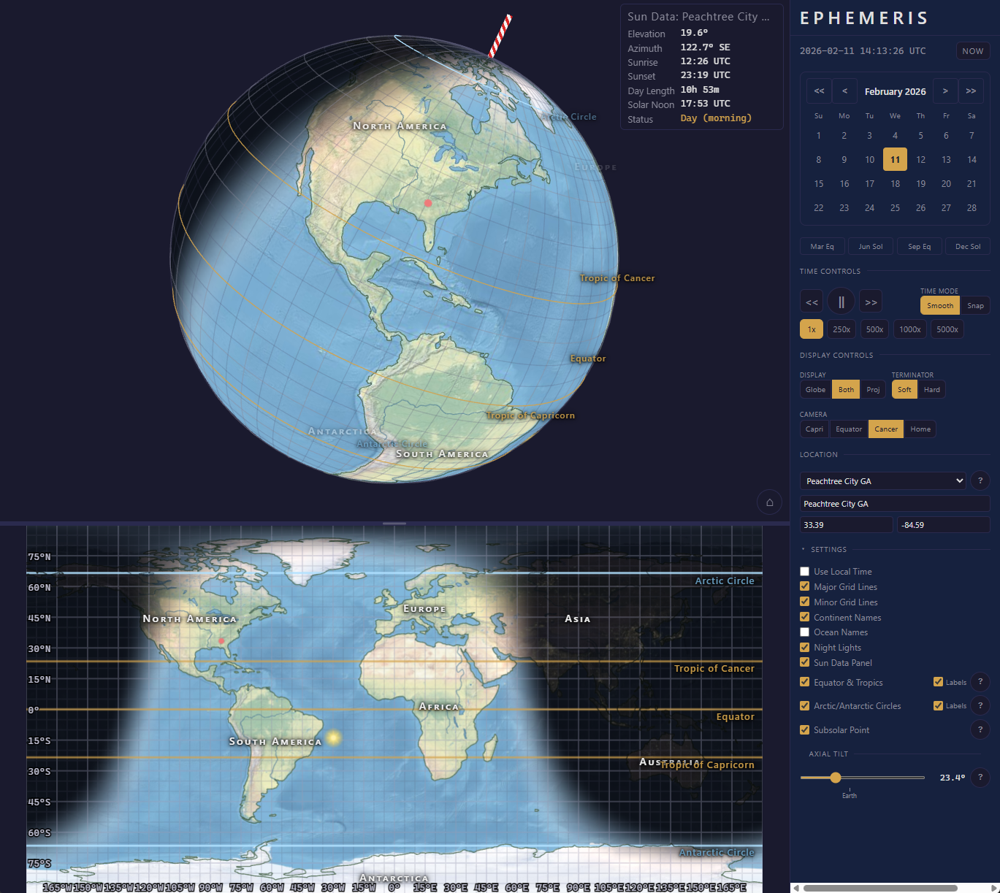

# Ephemeris

Interactive 3D visualization of Earth's day/night cycle and seasons. Built as a Progressive Web App for classroom use with kids ages 8+. This app is suitably accurate for classroom study of the natural effect of Earth's axial tilt (obliquity). It will become inaccurate in simulations exceeding +-200 years.

# Features 
- 3D globe and synchronized equirectangular projection showing the day/night terminator, computed from the sun's position using <a href="https://en.wikipedia.org/wiki/Jean_Meeus" target="_blank">Jean Meeus</a> algorithms
- Includes time controls (smooth sweep and day-snap modes)
- Geographic overlays (coastlines, rivers, lakes)
- Latitude reference lines (equator, tropics, arctic circles) & longitude reference lines
- Per-location sun data (sunrise, sunset, elevation, azimuth)
- Allows changing the Earth's axial tilt from zero to ninety degrees



# Installation

## Build and run, new install

Use these instructions if this is a new install of the application.

### With Docker Compose
```bash
git clone https://github.com/fatcat/ephemeris.git
cd ephemeris
docker compose build --no-cache
```

### With Docker
```bash
git clone https://github.com/fatcat/ephemeris.git
docker build -t ephemeris .
```

## Update the app

After the initial "clone" is performed, the app must be rebuilt if an update from the repo is made, or if any local changes to the code or container configuration are made.

### With Docker Compose, update app from repo

```bash
git pull
docker compose build --no-cache
```

### Start-up

Before starting the app, SSL certificates must be installed in ./ephemeris/certs. If this is a new clone of the repo, see the section on certificates below. If this is an existing install you should already have certificates in place. Pulling repo updates or performing a docker build does not alter the certificates.

```bash
# With Docker Compose
docker compose up -d

# With Docker
docker run -p 8181:8080 -p 8443:8443 -v ./certs:/certs:ro ephemeris
```

### Shutdown
```bash
# With Docker Compose
docker compose down

# With Docker
docker down
```

After bringing up the container the app will be running at https://x.x.x.x:8443 (HTTP on port 8181 redirects to HTTPS). These ports can be changed by editing `docker-compose.yml` and running `docker compose up -d`.

## HTTPS Certificates

Ephemeris requires HTTPS because the service worker (needed for offline/PWA support) [only registers over secure connections](https://developer.mozilla.org/en-US/docs/Web/API/Service_Worker_API/Using_Service_Workers#setting_up_to_play_with_service_workers). You have two options: self-signed certificates (simpler, good for local/classroom use) or publicly signed certificates (needed if the app is exposed to the internet with a domain name).

### Option A: Self-signed certificates (default)

The included `generate-certs.sh` script creates a local Certificate Authority (CA) and a server certificate signed by it:

```bash
./generate-certs.sh [hostname]    # hostname defaults to "ephemeris"
```

This creates three files in `./certs/`:
- `ca.crt` — the CA certificate (install this on client devices)
- `server.crt` — the server certificate
- `server.key` — the server private key

The container also serves the CA certificate at `https://<host>/ca.crt` for easy download.

After generating certs, you must install `ca.crt` on each device that will access the app so browsers trust the HTTPS connection.

#### Installing ca.crt on Windows

1. Download or copy `ca.crt` to the device (or navigate to `https://<host>/ca.crt`)
2. Double-click the `.crt` file
3. Click **Install Certificate...**
4. Select **Local Machine**, click **Next**
5. Select **Place all certificates in the following store**, click **Browse**
6. Choose **Trusted Root Certification Authorities**, click **OK**
7. Click **Next**, then **Finish**
8. Restart your browser

Alternatively, an administrator can deploy the certificate via Group Policy. See Microsoft's documentation on [distributing certificates using Group Policy](https://learn.microsoft.com/en-us/windows-server/identity/ad-fs/deployment/distribute-certificates-to-client-computers-by-using-group-policy).

#### Installing ca.crt on macOS

1. Download or copy `ca.crt` to the device (or navigate to `https://<host>/ca.crt`)
2. Double-click the `.crt` file — this opens **Keychain Access**
3. When prompted, add it to the **System** keychain (or **login** for single-user)
4. Find the certificate in Keychain Access (search for "Ephemeris Local CA")
5. Double-click it, expand **Trust**, and set **When using this certificate** to **Always Trust**
6. Close the window and enter your password to confirm
7. Restart your browser

See Apple's documentation on [installing a CA certificate on Mac](https://support.apple.com/guide/keychain-access/add-certificates-to-a-keychain-kyca2431/mac).

#### Installing ca.crt on ChromeOS

1. Open **Settings** > **Security and Privacy** > **More** > **Manage certificates**
2. Go to the **Authorities** tab and click **Import**
3. Select the `ca.crt` file and check **Trust this certificate for identifying websites**
4. Click **OK** and restart Chrome

#### Installing ca.crt on iOS/iPadOS

1. Navigate to `https://<host>/ca.crt` in Safari and tap **Allow** to download the profile
2. Open **Settings** > **General** > **VPN & Device Management** and install the downloaded profile
3. Go to **Settings** > **General** > **About** > **Certificate Trust Settings** and enable full trust for "Ephemeris Local CA"

#### Installing ca.crt on Android

1. Navigate to `https://<host>/ca.crt` in Chrome
2. When prompted, name the certificate and select **Wi-Fi** as the credential use
3. Confirm installation (you may need to set a screen lock if one isn't configured)

### Option B: Publicly signed certificates

If you have a domain name and want real certificates (no CA installation needed on clients), replace the self-signed certs with ones from a public CA like [Let's Encrypt](https://letsencrypt.org/).

1. Obtain a certificate and key for your domain. With [certbot](https://certbot.eff.org/):
   ```bash
   sudo certbot certonly --standalone -d yourdomain.example.com
   ```
2. Copy the certificate and key into the `./certs/` directory:
   ```bash
   cp /etc/letsencrypt/live/yourdomain.example.com/fullchain.pem ./certs/server.crt
   cp /etc/letsencrypt/live/yourdomain.example.com/privkey.pem ./certs/server.key
   ```
3. Start or restart the container:
   ```bash
   docker compose up -d
   ```

No `ca.crt` is needed — browsers already trust Let's Encrypt. You will need to renew certificates before they expire (every 90 days). See the [Certbot documentation](https://eff-certbot.readthedocs.io/en/latest/using.html#renewing-certificates) for automated renewal options.

If you are behind a reverse proxy (e.g. Traefik, Caddy, or an institutional load balancer) that already terminates TLS, you can skip the certificate setup entirely and proxy directly to the container's HTTP port (8080).


# Development

## Tech Stack

- Svelte 5 (runes mode) + TypeScript
- Three.js (WebGL)
- Vite + vite-plugin-pwa

## Run, build and test
```bash
npm install
npm run dev          # dev server with HMR
npm run build        # production build
npm run check        # type checking (svelte-check)
npm run lint         # eslint
```

## How the image works

The Dockerfile uses a two-stage build:

1. **Build stage** (`node:22-alpine`) — installs npm dependencies from `package-lock.json` and runs `npm run build` to produce static files in `dist/`
2. **Serve stage** (`nginx:alpine`) — serves the static output over HTTPS with TLS 1.2+, security headers, gzip compression, SPA fallback routing, and aggressive caching for Vite-hashed assets. Runs as the unprivileged `nginx` user (no root)

Final image size is ~63 MB.

### Updating dependencies

Some bundled data ages over time, albeit slowly.

- **Timezone boundaries** (`@photostructure/tz-lookup`) — IANA timezone data updates a few times per year as countries adjust timezone rules
- **npm packages** — periodic security patches

Updating containers once or twice a year is plenty to keep things current. To update:

```bash
npm update              # update packages within semver ranges
npm run build           # verify the build still passes
npm run check           # verify types
docker build -t ephemeris .   # rebuild the image
```

No external data is fetched at runtime. All textures, timezone data, and solar algorithms are bundled at build time. Rebuilding the image a couple of times per year is sufficient to stay current.

## License
Code is MIT.
All textures and geographic data are public domain (Natural Earth, NASA).
